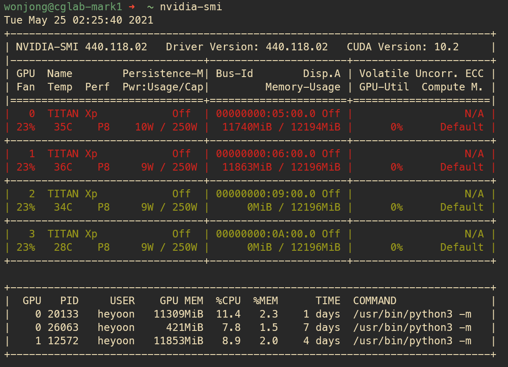

# nvidia-smi++
A tool for enriching the output of nvidia-smi.

# Additional features
When checking process information, you can get
- a *docker container name* instead of an username
- an *execution command* instead of a process name
- a colored output for better readability

# Install
`pip3 install nvidia-htop`

and copy nvidia-smi-plus.py into any directory you want. (recommend $HOME directory)

`chmod +x nvidia-smi-plus.py`

It will make the file executable.

Add alias into your `~/.zshrc` or `~/.bashrc`

`alias nvidia-smi=$YOUR_DIRECTORY/nvidai-smi-plus.py`

If you want colored output,

`alias nvidia-smi=$YOUR_DIRECTORY/nvidai-smi-plus.py -c`

If you want output with commandline length,

`alias nvidia-smi=$YOUR_DIRECTORY/nvidai-smi-plus.py -l`

# Usage
Just run the following command:

```bash
nvidia-smi
```

:blush:

# Screenshot


# Acknowledgments
This repo is highly dependent on https://github.com/peci1/nvidia-htop. Thanks for his nice work!
